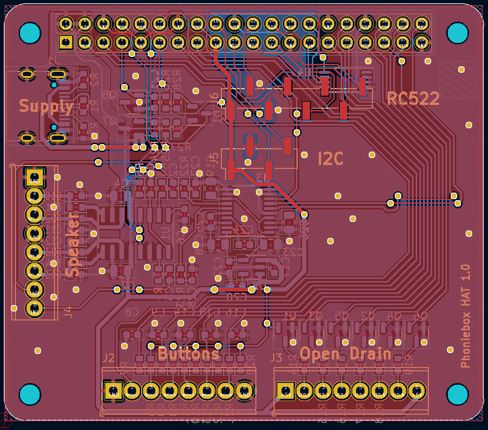

# phoniebox_hat
Raspberry Pi HAT for [RPi-Jukebox-RFID](https://github.com/MiczFlor/RPi-Jukebox-RFID)

In 2021 I built a Raspberry PI based Jukebox with RFID reader (see [here](https://github.com/MiczFlor/RPi-Jukebox-RFID/discussions/1331#discussioncomment-433065)). I used a breadboard for buttons and LEDs, USB sound card, ground loop isolator, PAM8403 amplifier. To disconnect the Raspberry from its USB power bank supply on shutdown, I used the awesome [OnOff SHIM](https://shop.pimoroni.com/products/onoff-shim) by Pimoroni.

This is a Raspberry Pi HAT for the 40W GPIO header. It integrates all of those functions on a single custom PCB:
 - DAC (PCM5102a)
 - Amplifier (PAM8406)
 - LED open drain buffers
 - Button inputs with hardware debounce
 - Screw clamps for connecting buttons and LEDs
 - Pin headers for RFID-RC522 and I2C
 - Battery disconnect circuit (the OnOff SHIM is awesome but I didn't want a separate PCB)
 - USB-C connector for power supply

The PCB complies to the official [HAT specification](https://github.com/raspberrypi/hats). Schematic and layout are done in KiCad 6.0. When ordering five PCBs including assembly at JLCPCB, one board costs around 18 USD.

